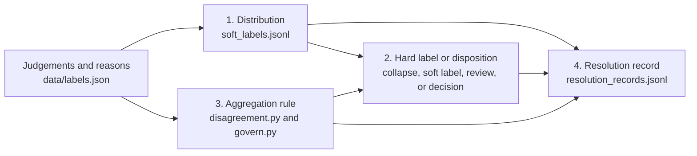

# Ground truth has no ground

[](https://github.com/releasecontrol/groundless-truth/actions/workflows/ci.yml)

> **Majority vote is not a neutral way to combine human judgement. It is a
> specific, contestable rule that silently makes governance decisions and ships
> them into the model as if they were facts.**

A small, self-contained argument — with a runnable proof and a trainer-ready
export — about the most consequential and least examined act in AI data
labeling: collapsing many human judgements into one "ground truth." For
contested / aesthetic / safety / synthetic-human data there is no ground truth
to *recover* — only a distribution of human judgement to *preserve* — and the
disagreement that pipelines are built to delete is usually the most valuable
signal in the set.

### The bill in 30 seconds

Run `python3 disagreement.py`. On the bundled demo, collapsing every cell to one
column would erase this:

```text
==============================================================================
THE BILL  --  what one 'ground truth' column would have erased
==============================================================================
  cells total .............................. 18
  CONFIDENT  (the collapse is honest) ...... 12
  CONTESTED  (the collapse destroys signal)  5
  REVIEW     (route to a human) ............ 1
  cells with a likely ERROR (real noise) ... 5  <- the few you DO fix
  VALUE FORKS (cohorts truly diverge) ...... 2  <- governance decisions, not labels
  MANUFACTURED CONSENSUS (minority silenced)  5
  disagreement entropy discarded ........... 5.78 bits across the set

  annotator reliability (leave-one-out, CONFIDENT cells only):
    b4: 0.67  <- below audit line; inspect, do not silently drop
    b2: 0.92
    b3: 0.92
    a1: 1.00
    a2: 1.00
    a3: 1.00
    a4: 1.00
    b1: 1.00
```

**The spine.** A label is not ground truth; it is the output of an aggregation
rule applied to evidence under a task definition — four objects, not one: the
**distribution** (statistical), the **hard label** (a decision), the
**aggregation rule** (governance), and the **record** (auditable).
[`the-bayes-optimal-label.md`](the-bayes-optimal-label.md) proves this from
decision theory, and the rest of the repo is those four objects examined closely:
the tools produce the distribution and the decision, the four foundations dissect
why the rule is never neutral, and the schema is the record.



### Choose a reading path

- **10 min — the argument:** read [`the-groundless-label.md`](the-groundless-label.md).
- **+20 min — the proof and payoff:** add
  [`the-bayes-optimal-label.md`](the-bayes-optimal-label.md), then run
  `python3 disagreement.py` and inspect the bill above.
- **Full descent:** continue through
  [`the-aggregation-theorem.md`](the-aggregation-theorem.md),
  [`the-frustrated-label.md`](the-frustrated-label.md),
  [`the-topological-label.md`](the-topological-label.md), and
  [`the-geometric-label.md`](the-geometric-label.md); then run the operational
  pipeline and inspect the [resolution-record schema](schema/resolution_record.schema.json).

### What's here

| file | what it is |
|------|------------|
| [`the-groundless-label.md`](the-groundless-label.md) | The argument. Read this first. ~10 min, grounded in current research (HLV, VariErr, pluralistic alignment, model collapse). |
| [`the-bayes-optimal-label.md`](the-bayes-optimal-label.md) | **The decision-theoretic spine.** A label is a Bayes action, not ground truth: under log loss the optimal prediction is the whole distribution (Thm 1); under 0–1 loss it is the mode (Thm 2); under a cost model with a *review* option, the optimal action at a value fork is review, not a label (Thm 5). Concedes majority vote is correct in its one regime and proves where it ends. Read after the argument. |
| `disagreement.py` | **Diagnostic.** Instead of majority vote: keeps the distribution, separates genuine *variation* from likely *error*, flags value forks and manufactured consensus, prices what the collapse to one label destroys. Writes `triage.json`. |
| `soft_labels.py` | **Operational.** Turns the triage into things a trainer consumes: per-cell soft labels + entropy-derived weights (`soft_labels.jsonl`), and a governance queue of value forks awaiting a named human owner (`governance.jsonl`). |
| `govern.py` | **Decision CLI.** Lists the governance queue and atomically records a named owner's decision, rationale, and timestamp before resolution records are emitted. |
| `aggregation.py` | **Proof.** Runs Arrow, May, and the Condorcet Jury Theorem against the same `data/labels.json`: the ribbon's "fact" flips with the aggregation rule, both 4–4 forks are decided by alphabetical order, and "get more labels" is shown to backfire under a shared norm. |
| `frustration.py` | **Proof.** Runs the spin-glass mapping on the same data: majority vote shown as a zero-temperature quench (and the bits it destroys), and an inferred-Ising ground state that recovers the two cohorts from votes alone (fact = ferromagnet, value fork = antiferromagnet, cyclic disagreement = spin glass). |
| `topology.py` | **Proof + diagnostic.** Shows the circle obstruction (Chichilnisky) and curl obstruction (Hodge), then applies an explicitly heuristic, thresholded camp complex to the demo votes. That diagnostic detects two disconnected cohort cores for the fork (`b₀=2`); it is not presented as a reconstruction of the theorem's preference space. |
| `geometry.py` | **Proof.** Runs the information-geometry centres on the same data: cross-entropy = the arithmetic centre, which on an ordered axis is bimodal where every metric-aware centre is central (gap 0.70 TV); prints a per-cell "geometry gap" so the choice of loss stops being a silent default. |
| `data/labels.json` | A tiny hand-built annotation set modeled on the scenario this repo grew out of: AI-generated editorial portraits, 8 annotators in 2 normative cohorts, 3 questions each. The source images are deliberately not distributed; each `desc` is their public stand-in. |
| [`data/README.md`](data/README.md) | **Bring your own data.** The input contract, a minimal example, and runnable conversion recipes for Label Studio JSON and wide CSV. |
| [`the-aggregation-theorem.md`](the-aggregation-theorem.md) | **The proof the argument didn't claim.** Social choice theory (Arrow 1951, May 1952, Condorcet 1785) already settled the thesis — and drew the exact line the triage draws by hand. Companion to the argument. |
| [`the-frustrated-label.md`](the-frustrated-label.md) | **The physics one layer down.** A crowd has no ground truth for the same reason a spin glass has no ground state (Parisi, Nobel 2021). The soft label is a Gibbs state at finite temperature; majority vote is the T→0 quench; model collapse is the second law applied to values. |
| [`the-topological-label.md`](the-topological-label.md) | **The shape underneath both.** Aggregation is possible iff the preference space is contractible (Chichilnisky). A reward model is a potential a value fork forbids (it has curl: H¹≠0). Baryshnikov: Arrow = this hole. Closes the triptych. |
| [`the-geometric-label.md`](the-geometric-label.md) | **The constructive turn (not a fourth impossibility).** Given you keep the cloud — *which* cloud? On the curved (Fisher) simplex the KL, Fisher–Rao, and Wasserstein centres disagree, and cross-entropy silently picks one. A computable "geometry gap" + a decision: choose the loss to match the label's semantics. |
| `resolution.py` | **Record emitter.** Joins the diagnostic, trainer export, governance state, and declared policy into one schema-conformant resolution record per cell. Writes `resolution_records.jsonl`; pending value forks remain escalated rather than pretending an owner has decided them. |
| [`schema/resolution_record.schema.json`](schema/resolution_record.schema.json) | **The record — what the whole argument produces.** A canonical record of one aggregation act: input judgements + reasons, the aggregation/tie-break rule, the loss/geometry, computed measures, the policy version + authority + owner, the disposition + conditions, and a deterministic replay-input hash. The hash covers evidence, rule, and policy version; it does not attest a later human choice. |
| [`schema/labels.schema.json`](schema/labels.schema.json) | JSON Schema for annotation input accepted by the three operational tools; the tools add zero-dependency referential-integrity checks. |
| [`adapters/README.md`](adapters/README.md) | **Real-data path.** Convert separately downloaded ChaosNLI label counters without inventing cross-item annotator identities; only a synthetic format fixture is committed here. |

### Run it (zero dependencies, Python 3.8+)

```bash
python3 disagreement.py     # diagnose -> triage.json
python3 soft_labels.py      # operationalize -> soft_labels.jsonl + governance.jsonl
python3 govern.py list      # inspect pending value forks
# optional: python3 govern.py decide --item ID --question Q --owner OWNER --decision LABEL --rationale WHY
python3 resolution.py       # record -> resolution_records.jsonl (after export/optional decision)
python3 bayes_optimal.py    # (optional) the decision-theoretic spine: a label is a Bayes action, not ground truth
python3 aggregation.py      # (optional) the theorem under the thesis: social choice theory on the same data
python3 frustration.py      # (optional) the physics under the thesis: the label as a frustrated (spin-glass) system
python3 topology.py         # (optional) the shape under the thesis: aggregation fails iff preference space has a hole
python3 geometry.py         # (optional) the constructive turn: which centre of the cloud? (your loss already chose)
```

### Run on your own data

Point all three data-processing stages at the same input and output directory;
inspect or decide the governance queue between export and resolution:

```bash
python3 disagreement.py --data my_labels.json --out out/
python3 soft_labels.py --data my_labels.json --out out/
python3 govern.py list --out out/
# optional: python3 govern.py decide --item ID --question Q --owner OWNER --decision LABEL --rationale WHY --out out/
python3 resolution.py --data my_labels.json --out out/
```

See [`data/README.md`](data/README.md) for the input format and runnable Label
Studio/wide-CSV conversion recipes; the contract is
[`schema/labels.schema.json`](schema/labels.schema.json). The three tools accept
arbitrary conformant annotations. The decision-theory spine and four foundation
scripts remain intentionally pinned to the bundled demo because their printed
narratives name its cohorts, ribbon, and 4–4 forks.

For a public real-dataset path, see the [ChaosNLI adapter](adapters/README.md).
ChaosNLI exposes anonymous per-item counts, so the adapter preserves the label
distribution without claiming stable annotator identity or meaningful
reliability/value-fork results.

The first prints a per-cell triage and a "bill" — how many bits of human
disagreement a single ground-truth column would erase, and where. The second
emits trainer-ready records and, crucially, a `governance.jsonl` **queue**: every
value fork the pipeline would otherwise resolve silently, held open until a named
human records a decision and a rationale. `govern.py` closes that loop explicitly;
the final stage writes the repository's fourth object, one auditable resolution
record per cell.

The full arc: **diagnostic → triage → trainer-ready export → governance queue → named decision → resolution record.**
Generated files (`triage.json`, `soft_labels.*`, `resolution_records.jsonl`) are
git-ignored; reproduce them by running the three scripts. `governance.jsonl` is the exception in spirit: the
exporter *merges* with any existing copy, preserving recorded decisions and owner
assignments across runs (and keeping a decided record even if a cell is no longer
a fork). Re-running never silently loses state — in production you persist this
file as a living backlog of policy decisions.

### What this does not prove

The dataset here is **illustrative, not empirical** — six images × three
questions, eight hand-built annotators in two designed cohorts. It exists to make
the mechanisms legible and the scripts runnable end-to-end, not to estimate how
often value forks, manufactured consensus, or geometry gaps occur in production.
The four foundational results (Arrow/May/Condorcet, the spin-glass mapping,
Chichilnisky, the information-geometry centres) are **mathematical**: they show
these failures *must* arise wherever plural judgement is aggregated under a
non-neutral rule — not that they are frequent in your data. That last question is
empirical, and this repo ships the instruments to measure it (the disagreement
bill, the frustration index, the geometry gap) rather than the measurement.

### The one thing to take away

So the honest deliverable of high-stakes labeling is not a label. It is the
**distribution + the reasons + a record of who got out-voted** — and, for
genuine value forks, a named human who owns the call.

That record has a shape: [`schema/resolution_record.schema.json`](schema/resolution_record.schema.json) — what an
aggregation act looks like when it is written down on purpose, replayable and owned.
